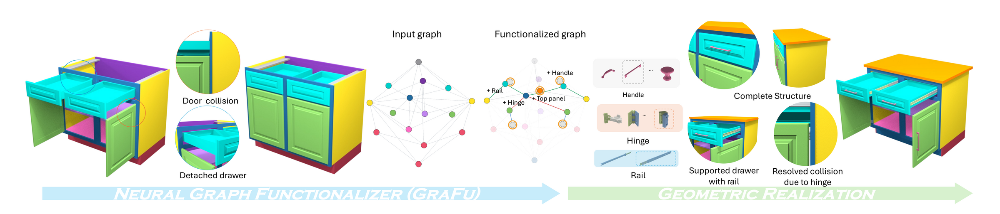

<p align="center">

  <h1 align="center"><a href="https://mingrui-zhao.github.io/Functionalization/" target="_blank">Functionalization via Structure Completion and Motion Rectification</a></h1>

  <p align="center">
    <a href="https://mingrui-zhao.github.io/" target="_blank"><strong>Mingrui Zhao</strong></a>
    ·
    <a href="https://sairajk.github.io/" target="_blank"><strong>Sai Raj Kishore Perla</strong></a>
    ·
    <a href="https://kwang-ether.github.io/" target="_blank"><strong>Kai Wang</strong></a>
    ·
    <a href="https://sauradip.github.io/" target="_blank"><strong>Sauradip Nag</strong></a>
    ·
    <a href="https://github.com/mingrui-zhao/Functionalization" target="_blank"><strong>Duc Anh Nguyen</strong></a>
    ·
    <a href="https://github.com/mingrui-zhao/Functionalization" target="_blank"><strong>Jiayi Peng</strong></a>
    ·
    <a href="https://suikei-wang.github.io/" target="_blank"><strong>Ruiqi Wang</strong></a>
    ·
    <a href="https://angelxuanchang.github.io/" target="_blank"><strong>Angel X. Chang</strong></a>
    ·
    <a href="https://msavva.github.io/" target="_blank"><strong>Manolis Savva</strong></a>
    ·
    <a href="https://arash-mham.github.io/" target="_blank"><strong>Ali Mahdavi-Amiri</strong></a>
    ·
    <a href="https://www.cs.sfu.ca/~haoz/" target="_blank"><strong>Hao Zhang</strong></a>
    <br />
    <i>SIGGRAPH Asia 2026</i>
  </p>

  <p align="center">
    <a href="https://arxiv.org/abs/2605.18010" target="_blank"><strong>arXiv</strong></a>
    |
    <a href="https://mingrui-zhao.github.io/Functionalization/" target="_blank"><strong>Project Page</strong></a>
  </p>

  <div align="center">
    
  </div>
</p>

This is the official implementation of **Functionalization**, which turns non-functional static furniture models into their functional counterparts. Functionalization parses per-part meshes into an unfunctional graph, predicts a functional graph with our neural graph functionalizer (GraFu), and realizes the predicted mechanical joints and missing structural components in Blender as a fully functional, animated, articulated model.

## Environment Setup

```
conda create -n func python=3.10
conda activate func
pip install -r requirements.txt
```

`requirements.txt` pins the CUDA 12.4 build of PyTorch 2.4.1 and pulls it
(plus the matching `torch-cluster` wheel) from the PyTorch and PyG wheel
indexes automatically. For a CPU-only machine, change the pin to
`torch==2.4.1` and drop the two index lines.

Blender 4.2+ is required for geometry realization and the add-on
(5.0 recommended).

## Downloads

Model weights, Blender template assets, and datasets are available on
[Hugging Face](https://huggingface.co/datasets/zmrr/Functionalization/tree/main).
Download all three archives in your browser and extract them at the repository
root, or use the CLI commands below.

| Asset | Archive | Size | Unpacks to |
|---|---|---|---|
| Checkpoints | `checkpoints.zip` | 327 MB | `checkpoints/` |
| Blender templates | `annotated_mechanical_parts.zip` | 17 MB | `annotated_mechanical_parts/` |
| Datasets | `datasets.zip` | 3.7 GB | `datasets/` |

Install the [Hugging Face CLI](https://huggingface.co/docs/huggingface_hub/guides/cli),
then download all three archives. Run these commands at the
repository root:

```bash
pip install -U huggingface_hub
hf download zmrr/Functionalization \
    checkpoints.zip annotated_mechanical_parts.zip datasets.zip \
    --repo-type dataset --local-dir .
unzip -q checkpoints.zip
unzip -q annotated_mechanical_parts.zip
unzip -q datasets.zip
```

After unpacking, the tree should look like:

```
Functionalization/
├── checkpoints/
│   ├── grafu_full.pt             # best for new models and HSSD
│   ├── grafu_subset_config_1.pt  # best for handle generation and attachment on PartNet-Mobility
│   └── grafu_subset_config_2.pt  # best for joint accuracy on PartNet-Mobility
├── annotated_mechanical_parts/
│   └── *.blend              # hinge / rail / handle templates
└── datasets/
    ├── furfun/              # our training set (233 models)
    ├── pnm_clean/           # PartNet-Mobility test set (345 storage furniture models)
    └── hssd_test/           # HSSD test set (50 storage furniture models)
```

All three archives are required for setup. The datasets bundle processed derivatives of
[PartNet-Mobility](https://sapien.ucsd.edu/browse) and
[HSSD](https://3dlg-hcvc.github.io/hssd/), provided for research use
under their upstream terms.

## Inference

On both test sets:

```
python infer.py --dataset pnm --checkpoint checkpoints/grafu_subset_config_1.pt --out results/pnm_run
python infer.py --dataset hssd --checkpoint checkpoints/grafu_full.pt --out results/hssd_run
```

Each run writes one `<mid>_pred.json` per model plus an
`inference_manifest.json` recording where the inputs live, so the run
directory is self-describing and the Blender add-on can load it with no
path configuration.

Inference also realizes every prediction as an animated `.blend` under
`<out>/blends/` (doors and drawers articulate over a closed-open-closed
cycle, hinge class chosen per joint by swing-collision testing). This
needs a Blender binary on `PATH` or in `$BLENDER`; pass
`--no-blenderize` to produce predictions only, or `--hinge
interior|exterior|flat` to force a hinge class.

New nodes are restricted to completion parts (top panel, shelf, divider,
handle); the geometric postprocess (on by default) removes orphans and edges that violate the joint type system.

To run on your own models, build a contact-only input graph from a folder
of per-part meshes named `<material>_<idx>.obj` (e.g. `side_panel_0.obj`,
`door_0.obj`), then point inference at it:

```
python scripts/build_unfunc_graph.py --mesh_dir <parts_dir> --out my_graphs
python infer.py --input_dir my_graphs --checkpoint checkpoints/grafu_full.pt --out results/my_run
```

Meshes are expected in a normalized frame (unit-ish scale, Z-up); see
`scripts/build_unfunc_graph.py --help` for the layout details.

## Geometry Realization in Blender

Interactive (recommended): install `blender_tools/functionalization_ui`
as an add-on, open the Functionalize tab, pick the run directory and a
model, and press Load. The model functionalizes automatically and every
joint remains editable; see the
[add-on README](blender_tools/functionalization_ui/README.md).

The add-on also works directly on the `.blend` files inference saves:
open any `<out>/blends/<mid>.blend` and press **Attach Opened Result**
in the Functionalize tab. The add-on reads the model's graphs through the
run manifest and adopts the installed joints, so you can edit hinges,
rails, and handles right away without reloading anything.

Headless batch:

```
blender --background --python-exit-code 1 \
    --python blender_tools/install_from_pred.py -- \
    --pred=results/my_run/<mid>_pred.json \
    --input=<input graph.json> --mesh_dir=<part meshes/> \
    --hinge=auto --drop-hallucinated --out=<mid>.blend
```

`--hinge=auto` picks the hinge class per joint by swing-collision
testing. The output animates a closed-open-closed cycle over frames 0 to
100. 

## Training

```
python train.py --config configs/train_full.yaml      # all 233 models
python train.py --config configs/train_subset.yaml    # PNM benchmark split, exclude fur 001-033
```

## Citation

If you find our work interesting, please cite

```bibtex
@inproceedings{zhao2026functionalization,
  title={Functionalization via Structure Completion and Motion Rectification},
  author={Zhao, Mingrui and Perla, Sai Raj Kishore and Wang, Kai and Nag, Sauradip and Nguyen, Duc Anh and Peng, Jiayi and Wang, Ruiqi and Chang, Angel X and Savva, Manolis and Mahdavi-Amiri, Ali and Zhang, Hao},
  booktitle={Proc. SIGGRAPH Asia},
  year={2026},
}
```

## License

The code in this repository is released under the [MIT License](LICENSE).
The datasets remain subject to their upstream terms
([PartNet-Mobility](https://sapien.ucsd.edu/browse) and
[HSSD](https://3dlg-hcvc.github.io/hssd/)); see their pages for details.
